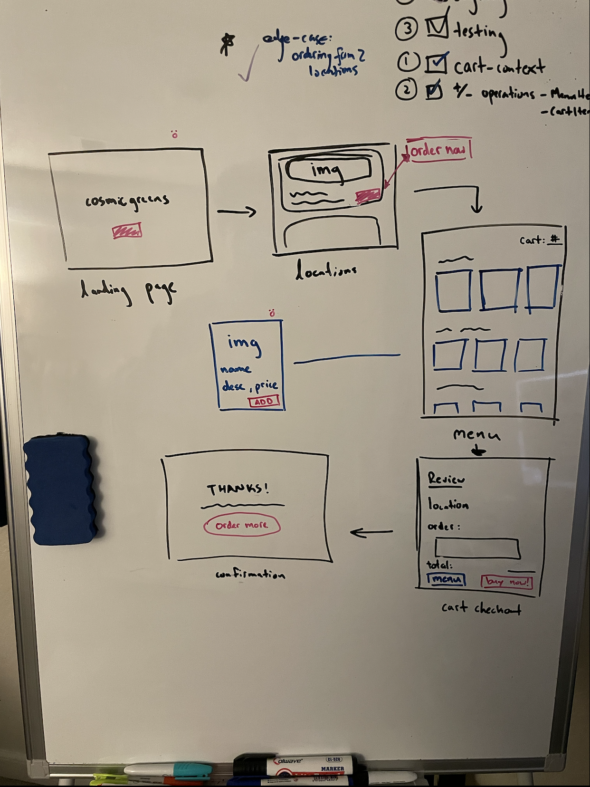

# Cosmicgreens

Order fresh food across the galaxy! Our locations are rapidly expanding, and we currently have offerings in Mars and California (Earth). Pickup only...

**NOTE:** this is a mock eCommerce application and not a real business :)  

## Technologies

- [GraphQL](https://graphql.com/): Created a consistent, predictable API service that can be used across the client by leveraging GraphQL's declaritive fetching model. Used to manage relationships, type enforce, and ease data retrieval
  - [Apollo Server](https://www.apollographql.com/docs/apollo-server): Self documenting and fun sandbox
- [React](https://react.dev/): Hooks (context, reducers, state, effect) for DOM management and page routing achieved with [React Router](https://reactrouter.com/en/main)
  - [Apollo Client](https://www.apollographql.com/docs/react/): For fetching local and remote data with GraphQL
- [NodeJS](https://nodejs.org/docs/latest/api/): Initialized server with Node + [Express](https://expressjs.com/)
- [TailwindCSS](https://tailwindcss.com/): Styled with a utility-first approach
- [Jest](https://jestjs.io/docs/getting-started): Included tests for important operations. This includes [React Testing Library](https://testing-library.com/docs/react-testing-library/intro/) for component testing via mock renders.


## Getting Started

Please follow the instructions closely to set up cosmicgreens in your local environment.

### Prerequisites
Make sure you have the following installed on your machine:

- Node.js: [Download and Install Node.js](https://nodejs.org/)
- Git: [Download and Install Git](https://git-scm.com/)
### Installation

1. Clone the repository:

    ```bash
    git clone https://github.com/your-username/cosmicgreens.git
    ```

2. Navigate to the project directory:

    ```bash
    cd cosmicgreens
    ```

3. Install dependencies:

    ```bash
    npm install
    ```

### Running the Application

Once the installation is complete, start the application:

```bash
npm start
```

## What's going on? 

cosmicgreen relies on graphql and react. Graphql powers both the frontend and backend through simple HTTP request/query handling. The data returned is used to fund all the info needed to build the React components

### A Look Under The Hood:

- An Apollo GraphQL server powering the APIs/client side operations + mock DB generated by [Mockaroo](https://www.mockaroo.com/)
- Upon running the application you may also play with the Apollo server playground at [localhost:4000](http://localhost:4000/)
- Mess around with the documentation and add, subtract, and remove items from your shopping cart. Then run this query to view your shopping cart.
```bash
query ViewShoppingCart {
  shoppingCart {
    items {
      menuItem {
        name
      }
      quantity
    }
    subTotal
  }
}
```
- The schema had to be carefully architected as it would lay the bedrock of my application
 - One important consideration was whether Location should have field of MenuItem or if MenuItem should have field of Location
 - I managed the 1 to Many (1:M) relationship between Location : MenuItem by defining the Location schema like so: 

```bash
 type Location {
  id: ID!
  name: String!
  location: String!
  menuItems: [MenuItem!]!
}
```


## How did you approach this?

### From whiteboard to development

It starts with an understanding of the user flow, which derives from project requirements. Here were the three (3) things I was looking to achieve: 
- View a restaurant’s menu for at least two separate locations
- CRUD operations between a menu item and a shopping cart
- Reach a checkout page that displays items in the current cart and a sub-total



From a wireframe, we chart the project's main challenges
- Design our GraphQL relationships. What typeDefs will we need?
- Global state for a user selected location. How to share that state across client?
- Client side GraphQL queries. What resolvers and queries will we need? 

### Development process

I took the above into consideration in order to set up flag poles across my development timeline. Then I built the application in the following order:
1. GraphQL service and everything DB
2. Scaffold React frontend 
3. Iterate on services/queries/resolvers
4. Flesh out the frontend
5. Test critical operations
6. Style and iterate on the above

## Why did you use this tech stack?

I chose a tech stack that was appropriate to the task, but also wanted it to challenge me. 

I've built GraphQL servers before, but not much work on the client-side – so [Apollo Client](https://www.apollographql.com/docs/react/why-apollo) was a natural choice. GraphQL is a popular query language that is gaining favorability over REST at many companies, so I thought this was a good chance to dive deep. 

React helps with state management, but the critical challenge was debating between something like [Redux](https://redux.js.org/) or [React APIs](https://react.dev/reference/react/apis) for global state management. I elected React APIs to reduce dev ramp up time and keep the project lean. 

React also organically encourages modularization and reusuable component design. So this helped tremendously when I was component testing with [Jest](https://jestjs.io/docs/getting-started) and [React Testing Library](https://testing-library.com/docs/react-testing-library/intro/) 

## When will this be ready for production? 

This project adheres to general coding practices such as modularization and an organized file structure. It also does its best to limit duplicate network calls by checking for cart size before querying. 

However there are a few things that need to be addressed before production

### Critical improvements

DB:
- Set up a long term database solution. I would reach for some SQL db intially to manage some of the complex relationships between menuItems and locations

Security:
- Sanitize user inputs to prevent injection attacks. I'd go through the codebase and ensure parameterized queries or prepared statements 

Testing:
- Expand test coverage for different scenarios, including edge cases.
- Set up automated testing for continuous integration and deployment (CI/CD).

Design:
- Expand responsiveness and unique mobile experience. Use media queries to control breakpoints

Beyond this, we need to make it to Mars before its ready for production!

## License

[MIT](https://choosealicense.com/licenses/mit/)